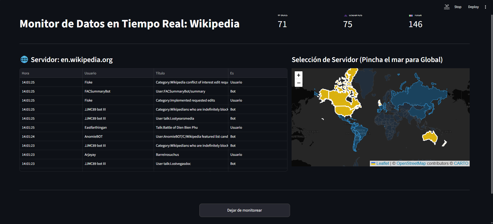

# 🌐 Wikipedia Live Stream Dashboard

> Monitor en tiempo real de ediciones en Wikipedia, con interfaz visual construida con **Streamlit** y navegación geográfica mediante mapas interactivos.

---

## 📌 Descripción

Este proyecto es la evolución de un monitor de terminal para Wikipedia. Aprovechando la API pública de  **[EventStreams de Wikimedia](https://wikitech.wikimedia.org/wiki/Event_Platform/EventStreams_HTTP_Service)** , el dashboard captura en tiempo real cada edición que ocurre en Wikipedia y la presenta de forma visual e interactiva.

El flujo de datos se basa en el protocolo  **Server-Sent Events (SSE)** : el servidor de Wikimedia empuja de forma continua objetos JSON con metadatos de cada cambio (usuario, título, servidor, si es bot, etc.) sin necesidad de hacer polling.

---

## 📸 Vista del Dashboard

<p align="center">
  
</p>
---

## 🗂️ Estructura del Proyecto

```
📁 proyecto/
├── 📁 .venv/                  # Entorno virtual de Python
├── 📁 images/
│   ├── dashboard_local.png    # Captura del dashboard
│   └── wikilogo.png           # Logo de Wikipedia (favicon)
├── .gitignore
├── .python-version            # Versión de Python fijada (uv)
├── pyproject.toml             # Metadatos del proyecto
├── pywiki.py                  # Aplicación principal (Streamlit)
├── README.md
├── requirement.txt            # Dependencias del proyecto
└── throttle.ctrl              # Control de throttle de pywikibot
```

---

## ✨ Funcionalidades

* **Stream en tiempo real** — recibe y muestra ediciones de Wikipedia al momento en que ocurren.
* **Selección de servidor por mapa** — haz clic en cualquier país del mapa interactivo para monitorear su Wikipedia en el idioma correspondiente (español, inglés, francés, etc.). Clic en el mar para cambiar al servidor global `commons.wikimedia.org`.
* **Métricas en vivo** — contadores actualizados de ediciones de bots 🤖, usuarios 👤 y total 📊.
* **Tabla de últimas ediciones** — muestra las 15 ediciones más recientes con hora, usuario, título y tipo.
* **Control de monitoreo** — botón para iniciar y detener el stream en cualquier momento.
* **Reset automático** — al cambiar de servidor, los contadores y la tabla se reinician solos.

---

## 🗺️ Servidores Disponibles

| Región                       | Países                                   | Servidor                  |
| ----------------------------- | ----------------------------------------- | ------------------------- |
| 🇪🇸 España y Latinoamérica | España, México, Argentina, Colombia…   | `es.wikipedia.org`      |
| 🇧🇷 Brasil                   | Brasil                                    | `pt.wikipedia.org`      |
| 🇬🇧 Anglófonos              | EE.UU., Reino Unido, Australia, Canadá… | `en.wikipedia.org`      |
| 🇫🇷 Francia                  | Francia                                   | `fr.wikipedia.org`      |
| 🇩🇪 Alemania                 | Alemania                                  | `de.wikipedia.org`      |
| 🇮🇹 Italia                   | Italia                                    | `it.wikipedia.org`      |
| 🇷🇺 Rusia                    | Rusia                                     | `ru.wikipedia.org`      |
| 🇯🇵 Japón                   | Japón                                    | `ja.wikipedia.org`      |
| 🇨🇳 China                    | China                                     | `zh.wikipedia.org`      |
| 🌍 Global                     | Clic en el mar                            | `commons.wikimedia.org` |

---

## 🧱 Origen: la versión de terminal

Antes del dashboard, el proyecto comenzó como un script de terminal puro:

```python
import json
import requests
import sseclient

def stream_wikipedia():
    url = 'https://stream.wikimedia.org/v2/stream/recentchange'
    headers = {
        'User-Agent': 'SBD_Analisis/1.0 (ProyectoEstudiante; contacto: estudiante@ejemplo.com)'
    }
    print("--- Intentando conectar con el servidor de Wikimedia ---")
    try:
        response = requests.get(url, headers=headers, stream=True, timeout=10)
        client = sseclient.SSEClient(response)
        print("--- ¡CONECTADO! Escuchando cambios en la Wikipedia en español... ---\n")
        for event in client.events():
            if event.event == 'message':
                try:
                    data = json.loads(event.data)
                    if data.get('server_name') == 'es.wikipedia.org':
                        user = data.get('user')
                        title = data.get('title')
                        print(f"-> [EDIT] {user} ha editado: {title}")
                except json.JSONDecodeError:
                    continue
    except requests.exceptions.ConnectionError:
        print("Error: No se pudo conectar. Revisa tu internet.")
    except KeyboardInterrupt:
        print("\nPrograma detenido por el usuario.")

if __name__ == "__main__":
    stream_wikipedia()
```

> ⚠️ El `User-Agent` es **obligatorio** para evitar el error `403 Forbidden` del servidor de Wikimedia.

---

## 🚀 Instalación y Uso

### 1. Clona el repositorio

```bash
git clone https://github.com/RMTorrabadella04/SBD_AnalisisTiempoReal.git
cd SBD_AnalisisTiempoReal
```

### 2. Crea el entorno virtual e instala dependencias

```bash
python -m venv .venv

# Windows
.venv\Scripts\activate

# macOS / Linux
source .venv/bin/activate

pip install -r requirement.txt
```

### 3. Ejecuta la aplicación

```bash
streamlit run pywiki.py
```

El dashboard se abrirá automáticamente en tu navegador en `http://localhost:8501`.

---

## 🛠️ Tecnologías Utilizadas

| Librería            | Uso                                           |
| -------------------- | --------------------------------------------- |
| `streamlit`        | Framework del dashboard web                   |
| `streamlit-folium` | Renderizado del mapa interactivo en Streamlit |
| `folium`           | Mapa interactivo con capas GeoJSON            |
| `sseclient`        | Consumo del stream SSE de Wikimedia           |
| `requests`         | Peticiones HTTP y conexión al stream         |
| `pandas`           | Gestión de la tabla de ediciones             |

---

## 📡 API Utilizada

**Wikimedia EventStreams**

* Endpoint: `https://stream.wikimedia.org/v2/stream/recentchange`
* Protocolo: Server-Sent Events (SSE)
* Documentación: [wikitech.wikimedia.org](https://wikitech.wikimedia.org/wiki/Event_Platform/EventStreams_HTTP_Service)

Cada evento contiene un JSON con campos como `server_name`, `user`, `title`, `bot`, `timestamp`, entre otros.

---

## 📄 Licencia

Este proyecto es de uso educativo y personal. Consulta los términos de uso de la API de Wikimedia antes de cualquier uso en producción.
